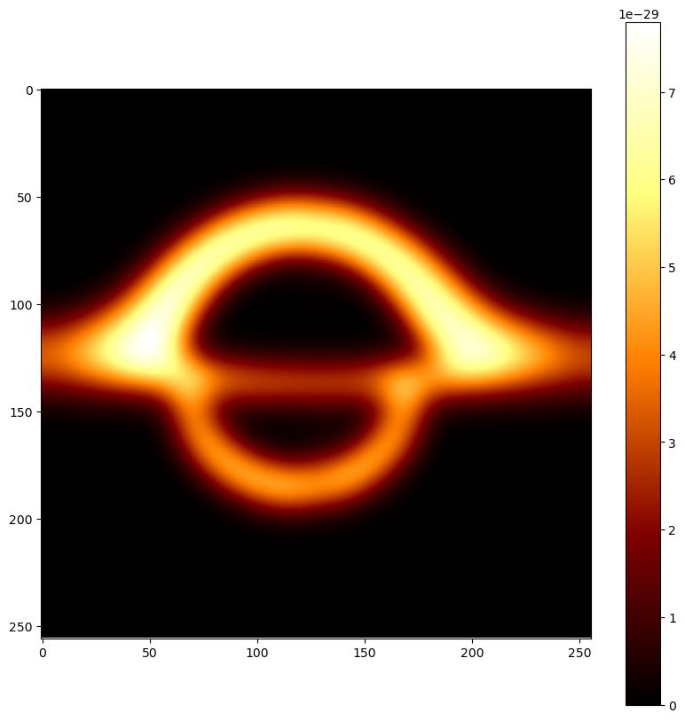

# BHTRACE - GRRT simulation of compact objects in arbitrary spacetimes, powered by PyTorch



BHTRACE is a Python library designed for simulating observations of compact objects, such as black holes, wormholes, and neutron stars. 

It is being developed within the context of my research into investigating the possibility of experimental evidence for nonlinear electrodynamics from observations of compact objects via effective geometry.

As many features are currently in progress, we welcome any advice, feedback,  suggestions or contributions.

## Key Features

*   **General Relativistic Radiative Transfer:** Simulate light radiation & propagation in complex spacetimes and mediums
*   **Novel Physics:** Primary focus on effective geometries sourced by nonlinear electrodynamics and support of other modifications of GeneralRelativity;
*   **Performance:** Leverages **PyTorch** for efficient, hardware-accelerated computations
*   **User-Friendly:** Aimed at being accessible to researchers regardless of their experience
*   **Extensibility:** Designed for easy customization through subclassing core components

**Notice:** *At this stage of development, BHTRACE is primarily intended for qualitative exploration. While geometric features are physically accurate, quantitative properties (e.g., intensities and spectra) may lack absolute numerical precision due to simplifications in the GRRT pipeline and medium simulations; however, the characteristic shapes and distributions remain physically representative. Additionally, all physical models within the package are still undergoing rigorous verification.*

## Installation

Prepare a shallow clone of this repository in local directory:
```
git clone --depth 1 https://github.com/alexeivorohov/bhtrace.git
cd bhtrace
```
Then install the package:
```bash
pip install .
```
**Note:** It is highly recommended to use a dedicated python environment for this package.

**Requirements:**
*   Python >= 3.12
*   Key dependencies: `torch`, `numpy`, `scipy`, `matplotlib`

## Usage & Examples

The best way to explore BHTRACE is by running the provided Jupyter notebooks in the `examples/` directory. These examples demonstrate various simulation scenarios, including Kerr black hole spectra and lensing effects.

*   `examples/kerr_bolometric.ipynb`: Simulating bolometric image of a Kerr black hole with Keplerian Disk.
*   `examples/kerr_spectral.ipynb`: Simulating spectral features of a Kerr black hole with Keplerian Disk.
*   `examples/effgeom_lensing.ipynb`: Observing photon lensing in effective geometries.
*   `examples/demo.ipynb`: A demo for investigating differences in observational appearance of Kerr black hole with Keplerian disk then effective geometry takes place.

## Project Metadata

*   **License:** MIT
*   **Author:** Alexei Vorokhov
*   **Repository:** [https://github.com/alexeivorohov/bhtrace.git](https://github.com/alexeivorohov/bhtrace.git)
*   **Bug Tracker:** [https://github.com/alexeivorohov/bhtrace/issues](https://github.com/alexeivorohov/bhtrace/issues)
*   **Changelog:** [https://github.com/alexeivorohov/bhtrace/blob/master/CHANGELOG.md](https://github.com/alexeivorohov/bhtrace/blob/master/CHANGELOG.md)
