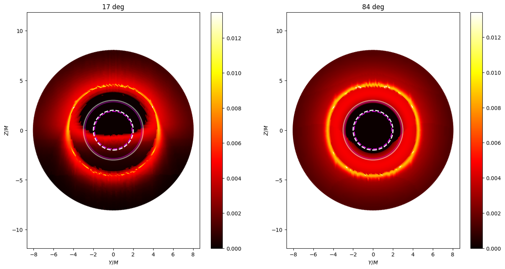

# BHTRACE - A python library for modeling observations of compact objects in effective geometry, sourced by nonlinear electrodynamics

## Description

This library is being developed in the context of our research into predicting possible experimental evidence for nonlinear electrodynamics from observations of compact objects - such as black holes, wormholes, and neutron stars. 

The primary goal of the library's design is to provide an intuitive and flexible tool for users regardless of their level of familiarity with Python or general relativity. We strive to make the principles and code accessible and understandable while maintaining the ability to perform scientifically relevant modeling in astrophysics, albeit at a significant computational cost.

As many features and methods are currently in progress, we welcome any advice, feedback, or suggestions from users and contributors.

## Imaging Approaches
The library incorporates thre approaches for imaging compact objects:
- The first approach follows standard ray-tracing procedure, which involves integration of well-known geodesic equations for photons int terms of Christoffel connection symbols. 
- The second approach employs Hamiltonian mechanics, where  Hamilton's equations are solved to obtain trajectories of light and particles in a given spacetime.
- [WIP] Source-Observer Task. This approach addresses the source-observer problem, utilizing this solution to reconstruct images through strong gravitational lensing.

  
